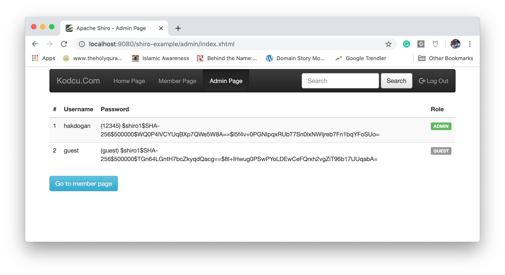

[](https://circleci.com/gh/hakdogan/ApacheShiro)


# Apache Shiro

This application demonstrates the use of the `Apache Shiro JDBC Realm` with `MySQL Database` in a Java Web Application(JSF2.2) 

## Exemplified topics

* Authentication
* Authorization
* JDBC Realm
* RememberMe functionality

## The application uses the following SQL Schema
```sql
CREATE USER 'shiro_user'@'%' IDENTIFIED BY 'shiro';
GRANT ALL PRIVILEGES ON shiro.* TO 'shiro_user'@'%' WITH GRANT OPTION;

CREATE DATABASE `shiro`;

USE `shiro`;

CREATE TABLE `user` (
  `id` int(11) NOT NULL AUTO_INCREMENT,
  `username` varchar(100) COLLATE utf8_turkish_ci NOT NULL,
  `password` varchar(100) COLLATE utf8_turkish_ci NOT NULL,
  PRIMARY KEY (`id`),
  UNIQUE KEY `username_UNIQUE` (`username`)
) ENGINE=InnoDB AUTO_INCREMENT=1 DEFAULT CHARSET=utf8 COLLATE=utf8_turkish_ci;

CREATE TABLE `userroles` (
  `userID` int(11) NOT NULL,
  `role` varchar(50) COLLATE utf8_turkish_ci NOT NULL,
  PRIMARY KEY (`userID`)
) ENGINE=InnoDB DEFAULT CHARSET=utf8 COLLATE=utf8_turkish_ci;
```
## Requirements
* JDK 8 or later
* Maven 3.0.0 or later
* MySql 8.x.x 

## To compile
```bash
mvn clean install
```

## To run
```bash
mvn liberty:run
```

or

```bash
sh run.sh
```

## With Docker
```bash
docker-compose -f docker-compose.yml up --build
```

or

```bash
sh compose-up.sh
```

This option creates a `MySql Server` with the database and user needed by the web application then runs together with the app.

## A screenshot of the application
